# Architecture
This document describes the overall architecture and design philosophy behind this app.

## Project structure



### `core`

The core library defines all the tournament types, traits and logic.

### `ui`

The user interface is la pièce de résistance! A frontend written entirely in rust (okok, there is some html and css as well but not a single line of javasript has been written by me in this product).
It compiles to a web assembly (WASM) module, creating a webpage where everything is displayed.
It is built with a framework called [leptos](https://leptos.dev).

### `db`

The database library exposes a rust interface to read and write data to a `sqlite3` database.

### `server`

The executable `wwc_server` is a very simple http server. The WASM `ui` cannot, for sand-boxing reasons, interact directly with the database.
Instead, the `wwc_server` acts as a bridge to enable the `ui` to make database calls through a http api.
The intention is to have an as ~stupid~ simple as possible `db` representation.
This means storing a raw, basic representation of the data in the database.
The data are deserialized in the server and sent to the UI.

Rust is excellent at serialisation/deserialisation (through the crate [`serde`](https://serde.rs/)) and since the server and UI both use the same types defined in `core`,
the actual http communication is very easily abstracted.

### `cli`

Creates a command line interface `wwc_cli`. Convenient way of initialising the database with teams, games and betters.
The CLI has no restrictions like the `ui` and can communicate directly with `db` and so have an explicit dependency on `db`.

### `data`

Interface to handle external data sources.

## Design patterns

### Dumb backend, smart frontend.

The frontend user interface `ui` is written in the same language as the `core` library (rust), which both compile to web assembly [_WASM_](https://webassembly.org/).
This enables a trivial backend, which does no more than serve up raw data and leaves all calculations to be done in the browser.
The great benefit of this is that code -- functions, types and implementations -- can be re-used, as opposed to having two implementations of everthing in rust for the backend and js for the frontend.
This is especially good given the high level of abstraction used here with the type safety described in the next section.
Of course, somewhere in the pipeline the well-structured types need to be passed around as raw data (JSON in this case) in the communication between database and ui, but this can all be hidden since rust excels at this conversion,
i.e. in serialisation and deserialisation of data.

### Type safety

Many of the data in this lib: goals scored, number of games, team rank, group point, et c, are in principle (non-negative) integers.
Having many data types with shared representation but wildly differing semantics is to beg for bugs.
To avoid that -- and in fact to make this class of bugs unrepresentable -- this lib consistently implements types with the [newtype pattern](https://rust-unofficial.github.io/patterns/patterns/behavioural/newtype.html), e.g.

```rust
#derive[..., Add, ...]
pub struct GoalCount(u32);
```

So instead of using a non-negative integer `u32` to represent a goal count, we _wrap_ it in a new type `GoalCount`.
It requires more boilerplate in the first place but when it's in place it's ergonomic and hard to misuse.

One particularly nice feature is that the newtype pattern opts out of all the [trait implementations](https://doc.rust-lang.org/stable/book/ch10-02-traits.html) of the wrapped type,
i.e. the new type does not "inherit" any functionality from the inner type.
In the `GoalCount` example above, the new type does not have any functionality that we associate with an integer, like arithmetics, unless we specifically enable it.
Enabling requires a trait implementation for the desired functionality, either through a manual implementation or with a derive macro.

Above you see how the `Add` trait (i.e. enabling the `+` operator) is auto-impl. with the [`derive_more`](https://crates.io/crates/derive_more) crate
(NB. the auto impl _only_ allows for addition where both values are of type `GoalCount`).
The `Sub` trait on the other hand is manually implemented to reflect the fact that the difference between two `GoalCount`'s is not a `GoalCount` but a `GoalDiff`:

```rust
impl Sub for GoalCount {
    type Output = GoalDiff;
    fn sub(self, other: Self) -> Self::Output {
        GoalDiff(self.0 as i32 - other.0 as i32)
    }
}
```

Conversely, addition for the type `TeamRank` has no semantic meaning and subsequently does not impl `Add` with any types.
Trying to add two `TeamRank` (or a `TeamRank` with any other type) values will result in a compilation error,
catching potential logic bugs which would have gone undetected if everything was of the standard integer type.

### Parse, don't validate

Another benefit of the [Type safety design](#type-safety) is that we can realise the [parse, don't validate](https://lexi-lambda.github.io/blog/2019/11/05/parse-don-t-validate/) pattern.
Rust is a stickler for [error handling](https://doc.rust-lang.org/stable/book/ch09-00-error-handling.html): potential errors must be dealt with explicitly.

Consider the score of a playoff game. It can be represented by two non-negative integers (specifically two `GoalCount`s), except that some combinations of integers would be invalid since a playoff game must have a winner.

Every function that takes such a score tuple as input, would require validation of the score, returning an error when it encounters a draw result.
This pollutes the API and failure to perform this validation could cause weird results (not really for this example due to rust's inherent type safety but for more complex examples it certainly would).

Instead of validating a general tuple we use the newtype pattern to create

```rust
# NB. This is a simplified version of the actual type in the `core` crate
pub struct PlayoffScore(GoalCount, GoalCount);

impl PlayoffScore {
    pub fn try_new(home: GoalCount, away: GoalCount) -> Result<Self, PlayoffError> {
        if home == away {
            Err(PlayoffError::NoWinner)
        } else {
            Ok(PlayoffScore(home, away))
        }
    }
}
```

By making the inner types private (by not adding public identifiers: `PlayoffScore(pub GoalCount, pub GoalCount)`),
the only way to construct a `PlayoffScore` is via the `try_new` constructor which _parses_ the goal counts into a validated score.
Every function that deals with playoff scores can now take inputs of type `PlayoffScore` and not have to worry about equal results and the API is spared `Result<T, E>` return types (which, in rust, is a must for functions that can fail) in every function.

### Panicking

Rust has no `null` value, so you can't set a value to `null` if certain conditions aren't met.
Instead, Rust's standard lib. provides the enum types [`Result<T, E>`](https://doc.rust-lang.org/std/result/index.html) and [`Option<T>`](https://doc.rust-lang.org/std/option/index.html) to represent fallible and optional values respectively.
This is one of the best features in the language, since the compiler forces you to handle all edge cases.
There is an escape hatch though, called `.unwrap()` that converts `Result<T, E> --> T` and `Option<T> --> T`;
in the "happy path" (i.e. where the desired value is present) you unwrap the enum to get the value you want, if not the program "panics":

```rust
// Happy path: Unwrap accesses the inner value.
let happy_option: Option<u32> = Some(232);
let unwrapped_int: u32 = happy_option.unwrap();
assert_eq!(unwrapped_int, 232);
// The optinal value is `None`, program panics.
let null_option: Option<u32> = None;
let unwrapped_int: u32 = null_option.unwrap(); # <-- Panic
```

(The `.unwrap()` method is implemented for `Result<T, E>` as well.)

The term "panic" is very alarmistic; panics do not cause a C style segfault but is more like an exception. On a panic, the stack is safely unwinded and the program exits.
_NB: you can also cause panic by invoking the [`panic!` macro](https://doc.rust-lang.org/std/macro.panic.html)._

Even so, any panic inducing code should not be used in this project. If we avoid using it, we can trust the app to never fail which is nice when it will be running on some remote instance "in production".
Presently, there are some panics in the codebase, and there is an [open issue](https://github.com/jackonelli/wednesday-world-cup/issues/17) for their removal.
There are some exceptions to this rule though:

- In tests it is fine to panic. Test code does not run in production (it is not even compiled).
- There are some internal functions that unwraps results and options since you can "prove" that the unhappy path can never occur.
  These case must be well-documented and well-tested though. See examples in `core::group::stats`.

### Functional

The code base is inherently functional, as it in general does not mutate any states. This is inline with the dumb backend, smart frontend policy.

A relevant example is the `Group` struct which models the teams, games and scores of a single tournament group.
It is defined as:

```rust
pub struct Group {
    played_games: Vec<PlayedGroupGame>,
    unplayed_games: Vec<UnplayedGroupGame>,
}
```

The only data the struct holds is two lists of played and unplayed games. It does store any intermediate stats, such as games played, goals scored et c.
Instead, these values are computed on the fly when need, as they are functions of the group's games.
What teams are in a group? Compute it from the games:

```rust
pub fn team_ids(&self) -> impl Iterator<Item = TeamId> {
    Group::unique_teams_in_games(&self.played_games)
        .chain(Group::unique_teams_in_games(&self.unplayed_games))
        .unique()
}
```
Which team won the group? Compute it from the games:

```rust
pub fn winner(&self, rules: &Rules) -> TeamId {
    order_group(self, rules).winner()
}
```

Why is it implemented like this?
- I don't know how a database works, so constantly updating and reading intermediate values, like the goal difference, seems like a horrible idea.
- This way is also far less complex, as failing to keep track of a mutable state can lead to some spicy bugs.

The downside is of course that the implementation makes a lot more computations than is strictly necessary.
However, due to the nature of the application, some 50 games and groups of four teams are never going to cause performance issues.
