# Wednesday world cup

Tournament betting app.

## Design ideas

### Dumb backend, smart frontend.

The frontend user interface `ui` is written in the same language as the `core` library (rust), which both compile to webassembly [_wasm_](https://webassembly.org/).
This enables a trivial backend, which does no more than serve up raw data and leaves all calculations to be done in the browser.

### Type safety

Many of the data in this lib: goals scored, number of games, team rank, group point, et c, are in principle (positive) integers.
Having many data types with shared representation but wildly differing semantics is to beg for bugs.
To avoid that -- and in fact to make this class of bugs unrepresentable -- this lib consistently implements types with the newtype pattern, e.g.

```rust
#derive[..., Add, ...]
pub struct GoalCount(u32);
```

It is much more verbose to implement in the first place but when it's in place it's very ergonomic/hard to misuse.

One particular nice feature is that the newtype pattern opts out of all the trait implementations of the wrapped type.
This makes enforcing semantics very ergonomic.
In the `GoalCount` example above, for instance, the `Add` trait (i.e. enabling the `+` operator) is auto-impl. with the [`derive_more`](https://crates.io/crates/derive_more) crate
(NB. the auto impl _only_ allows for addition where both values are of type `GoalCount`).
The `Sub` trait on the other hand is manually implemented to reflect the fact that the difference between two `GoalCount`'s is not a `GoalCount` but a `GoalDiff`:

```rust
impl Sub for GoalCount {
    type Output = GoalDiff;
    fn sub(self, other: Self) -> Self::Output {
        GoalDiff(self.0 as i32 - other.0 as i32)
    }
}
```

Similarly, addition for the type `TeamRank` has no semantic meaning and subsequently does not impl `Add` with any types.

### Functional

Currently, not purely functional due to a borrow-checker work-around.

## Project structure



### `core`

The core library defines all the tournament types, traits and logic.

### `ui`

The user interface is la pièce de résistance! A frontend written entirely in rust (okok, there is some html and css as well but not a single line of javasript is used in this product).
It compiles to a wasm module, creating a webpage where everything is displayed.
It is built with a framework called [Seed](https://seed-rs.org/).

### `db`

The database library exposes a rust interface to read and write data to a `sqlite3` database.

### `server`

The executable `wwc_server` is a very simple http server. The wasm `ui` cannot, for sand-boxing reasons, interact directly with the database.
Instead, the `wwc_server` acts as a bridge to enable the `ui` to make database calls through a http api.
The intention is to have an as ~stupid~ simple as possible combination of `db` and `server` and leave the complexity for the UI.
This means storing a raw, basic representation of the data in the database and having the server provide access to it as is.
The data will then be deserialized into more complex structures, directly in the UI.

### `cli`

Creates a command line interface `wwc_cli`. Convenient way of initialising the database with teams, games and betters.
The CLI has no restrictions like the `ui` and can communicate directly with `db` and so have an explicit dependency on `db`.

### `data`

interface to handle external data sources.

## Setup

The `server` is built with a rust framework called [Rocket](https://rocket.rs/)
It requires a nightly version of the rust compiler:

```bash
# NB. this switches to the nightly compiler in the current repo only.
rustup override set nightly
```

[Presumably](https://github.com/SergioBenitez/Rocket/issues/19) Rocket is already available on stable, though not yet on the official registry (crates.io).
Anyway, it doesn't bother me enough to track the master branch, just to leave nightly.

### Database setup

requires the `diesel-cli`, get it with:

```bash
cargo install diesel_cli --no-default-features --features sqlite
```

```
# Preferably in a ".env" file.
export WWC_ROOT=$(pwd)
export DATABASE_URL=$WWC_ROOT/<path_to_db>
cd $WWC_ROOT/db
diesel setup
diesel migration run
```

### UI setup

### WASM compilation

Install [`wasm-pack`](https://rustwasm.github.io/wasm-pack/installer/#).
Some pre-built binaries are provided but the `cargo install` option works just as well.

#### Local hosting

Any webserver will do. I find [`microserver`](https://github.com/robertohuertasm/microserver) to be very convenient.
Simply install with `cargo install microserver`

### Optional

Install [`cargo-make`](https://github.com/sagiegurari/cargo-make#installation).
The repo contains some `Makefile.toml`, which defines some long and tedious build commands which can be accessed with `cargo-make`.
I don't love `cargo-make` but it is kind of helpful to document all the build commands.

## Docs

Generate the dependency graph:

```bash
mmdc -i assets/dep_graph.mmd -o assets/dep_graph.svg
```
